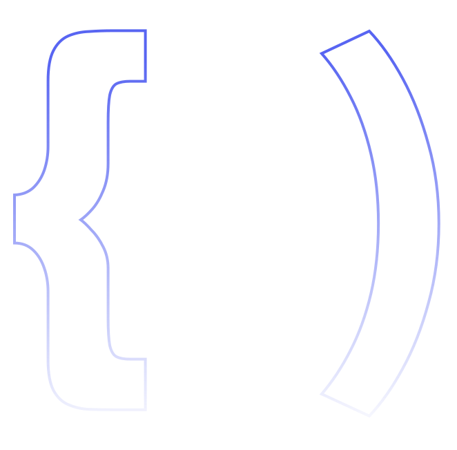

<h2> Olá! Eu sou o João Pedro☕</h2>

Bem-vindo ao meu perfil, que será usado para expor meus projetos pessoais e progresso dos meus estudos na área de desenvolvimento, meu nome é João, mas você pode me chamar de JP, sou um desenvolvedor iniciante apaixonado por computação e pela area de Design. Você pode seguir meu perfil e minhas redes sociais para obter mais informações sobre mim.

 

<h3> Conhecimentos:

 

</h3>

<h2> Estatisticas:</h2>

 
